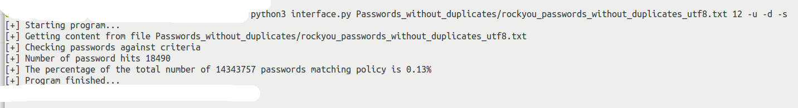

# Password Policy Analyzer

PPA is a script that lets you search for passwords given different criteria found in password policies such as, use of uppercase or digit.
The script displays the number of passwords that match the criteria and the percentage of the total passwords.

Development environment:
- Ubuntu 20.04 64-bit
- Kernel 5.8.0-44-generic
- Python 3.8
 
Packages used can be installed by running
```sh
pip install -r requirements.txt
```

### Example use

**Positional arguments:**
```sh
file - Enter filename containing passwords
length - Specify min length of password. Must be between 1 - 20 characters
```

**Optional arguments:**
```sh
-h, --help, - show this help message and exit
-u, --uppercase, - Checks if password contain uppercase character
-l, --lowercase, - Checks if password contain lowercase character
-s, --special, - Checks if password contain special character
-d, --digit, - Checks if password contain digit
-a, --all, - Checks if password satisfy all criteria classes
--startUendD, - Checks if password starts with uppercase and end with digit
--startUppercase, - Checks if password start with uppercase
--endDigit, - Checks if password end with digit
--encoding, - Chose what kind of encoding the password file is. Default is utf-8, choices=[utf-8, utf-16, iso-8859-15]
```

```sh
python3 interface.py password_file character_length arguments
python3 interface.py passwords.txt 12 -u -d -s
```
The example searches for passwords with a minimum character length 12 containing at least one uppercase character, one digit, and one special character.
The special characters include " !"#$%&'()*+,-./:;<=>?@[\\]^_`{|}~"

### Example result
